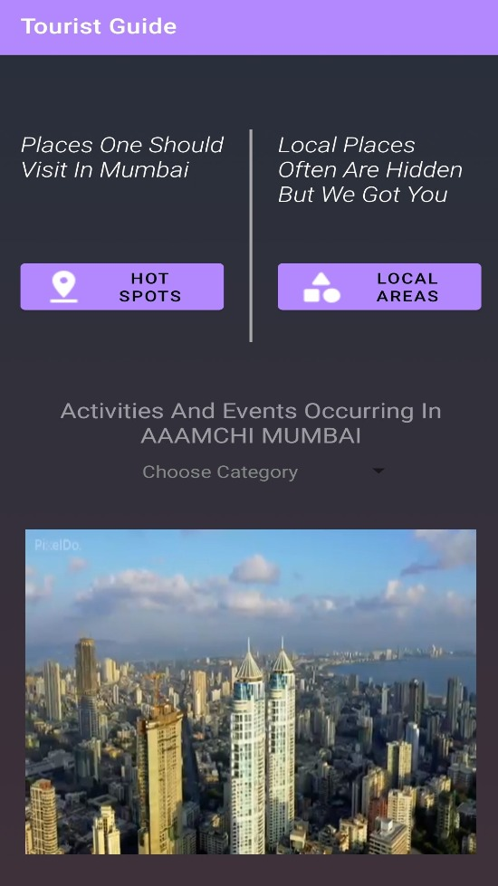
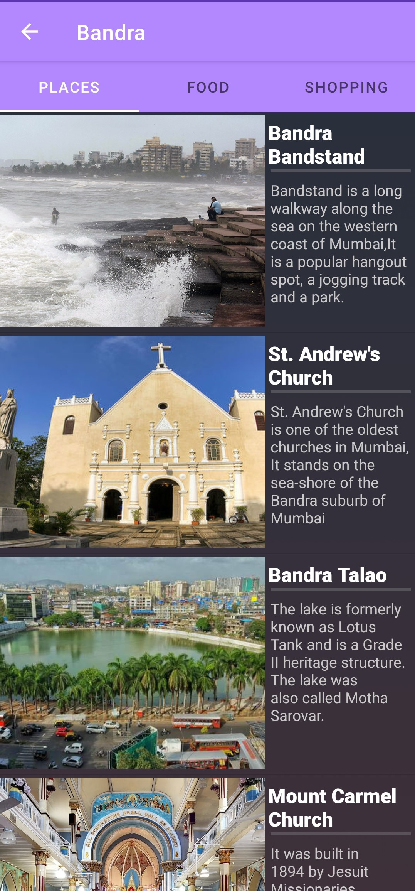
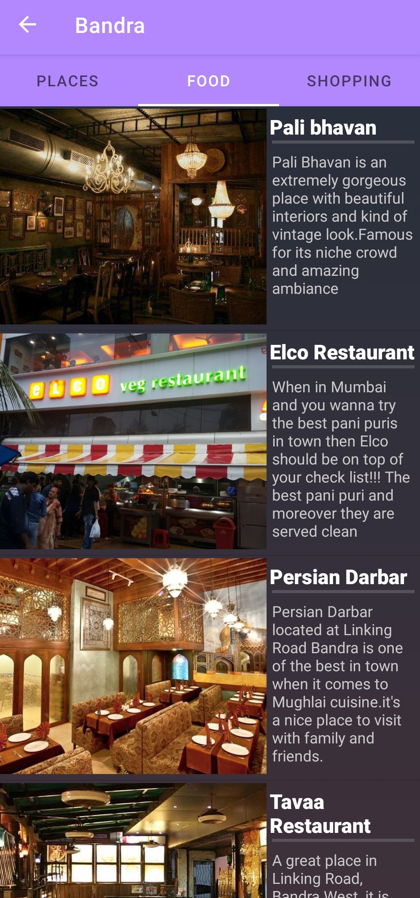
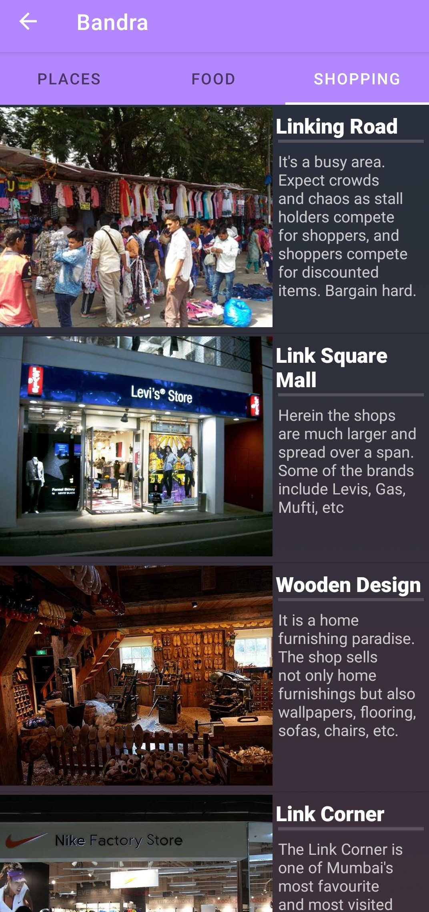
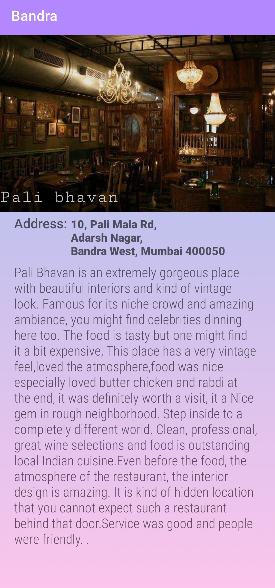

## Tourist Guide
 Tourist guide helps one keep track of events and activities happing in MUMBAI, has places where more often Local area people visits, 
 Haunted places in mumbai, And tourist attractions too.
 
 ## Running the App
 The only way to run this app is to downlod and run **Tourist Guide.apk**
 
 # How the App Looks
 
 ## Main Dashboard

Theres a video playing on the bottom of the screen, an overview of how mumbai looks. One can choose to view events and acitvities happing in mumbai,Local areas and Tourist Spots.

### Local Areas
Local areas are the areas where Local people often meet and tourist are mostly unaware of
 - Haunted Places 
 - Secrete Spots
 
### Hot Spots
Hot spots have places which are mostly populated with tourist attractions
  - Places
  - Food
  - Shopping
  
  
  ## Events
  
  
  Has events occured in Mumbai and redirects one to the offical websited for that particular event.
  
 
 ## Local Areas
 
 Has Information related to abnormal activity in Mumbai and also as Secrete Spots where locals often visit.
 
## Hot Spots
   

 It has the list of places, food and shopping spots for a particular place.

When Clicked it shows the address and the information related to that particular place.

 
 
 # What I learned While creating Tourist Guide
 
how to work with multiple activities, How to create a custom adapter for a listview,  How to reuse a particular activity dynamically resulting in a huge reduction of app size, How to handle fragments, and handle video in an activity
 
